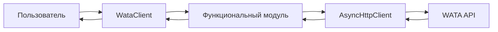
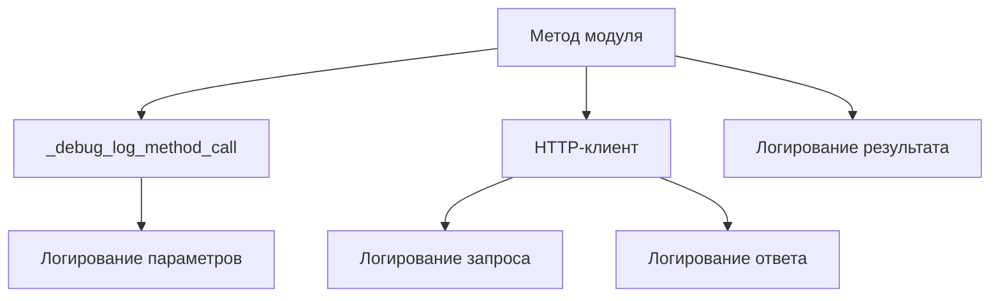

# WataProClient - Архитектура и внутреннее устройство

## 🏗️ Общее описание

WataProClient - это современный асинхронный клиент для взаимодействия с платежным API WATA, построенный по модульной архитектуре. Клиент обеспечивает надежное, безопасное и удобное взаимодействие с API, включая расширенные возможности отладки и мониторинга.

### 🎯 Основные цели

- Предоставить простой и интуитивный интерфейс для работы с WATA API
- Обеспечить надежность через отказоустойчивые механизмы
- Предоставить подробные средства отладки и мониторинга
- Поддерживать безопасность на всех уровнях взаимодействия
- Обеспечить модульность и расширяемость архитектуры

## 📁 Структура проекта

```
wataproclient/
├── __init__.py                 # Экспорт основных классов и версия
├── client.py                   # Основной класс клиента WataClient
├── manager.py                  # Менеджер клиентов WataClientManager
├── http.py                     # HTTP-клиент с детальным логированием
├── exceptions.py               # Система иерархических исключений
└── modules/                    # Функциональные модули API
    ├── __init__.py             # Экспорт модулей
    ├── base.py                 # Базовый класс с отладочными возможностями
    ├── links.py                # Модуль платежных ссылок
    ├── transactions.py         # Модуль транзакций
    └── webhooks.py             # Модуль верификации вебхуков
```

## 🔧 Архитектурные компоненты

### 1. WataClient (client.py)

Центральный класс клиента, который объединяет все компоненты системы:

```python
class WataClient:
    """Клиент для платежного API WATA."""
    
    def __init__(self, base_url, jwt_token=None, timeout=30, 
                 max_retries=3, log_level=logging.INFO):
        # Инициализация HTTP-клиента
        self.http = AsyncHttpClient(...)
        
        # Инициализация функциональных модулей
        self.links = LinksModule(self.http)
        self.transactions = TransactionsModule(self.http)
        self.webhooks = WebhooksModule(self.http)
```

**Ключевые особенности:**
- 🔄 Поддержка асинхронных контекстных менеджеров
- 📊 Встроенное логирование с конфигурируемыми уровнями
- 🔒 Безопасное управление ресурсами
- 🧩 Модульная архитектура

### 2. AsyncHttpClient (http.py)

Асинхронный HTTP-клиент с расширенными возможностями отладки:

```python
class AsyncHttpClient:
    """Асинхронный HTTP-клиент для WATA API."""
    
    async def _request(self, method, endpoint, params=None, data=None, headers=None):
        # Подробное логирование запроса
        self.logger.debug(f"=== ОТПРАВКА HTTP ЗАПРОСА ===")
        self.logger.debug(f"Метод: {method}")
        self.logger.debug(f"Полный URL: {url}")
        self.logger.debug(f"Заголовки: {all_headers}")
        
        # Выполнение запроса с повторными попытками
        # ...
        
        # Подробное логирование ответа
        self.logger.debug(f"=== ПОЛУЧЕН HTTP ОТВЕТ ===")
        self.logger.debug(f"Статус ответа: {response.status}")
        self.logger.debug(f"Заголовки ответа: {dict(response.headers)}")
```

**Возможности:**
- 🔁 Автоматические повторные попытки с экспоненциальной задержкой
- 🛡️ Автоматическое добавление заголовков аутентификации
- 📝 Детальное логирование всех HTTP-операций
- ⚡ Асинхронное выполнение запросов
- 🔧 Настраиваемые таймауты и стратегии повторов

### 3. Система исключений (exceptions.py)

Иерархическая система исключений для точной обработки ошибок:

```python
ApiError                      # Базовое исключение
├── ApiConnectionError        # Ошибки соединения
│   ├── ApiTimeoutError      # Таймауты
├── ApiAuthError             # 401 - Ошибки аутентификации
├── ApiForbiddenError        # 403 - Доступ запрещен
├── ApiResourceNotFoundError # 404 - Ресурс не найден
├── ApiValidationError       # 400 - Ошибки валидации
├── ApiServerError           # 500 - Ошибки сервера
├── ApiServiceUnavailableError # 503 - Сервис недоступен
└── ApiParsingError          # Ошибки парсинга ответа

def create_api_error(status_code, message, response_data=None):
    """Создает соответствующие исключения на основе HTTP-статуса."""
```

### 4. Функциональные модули (modules/)

#### BaseApiModule (base.py)

Базовый класс для всех функциональных модулей:

```python
class BaseApiModule(ABC):
    """Базовый класс для всех модулей API."""
    
    def _debug_log_method_call(self, method_name: str, **kwargs):
        """Логирование вызова метода API в debug режиме."""
        if self.logger.isEnabledFor(logging.DEBUG):
            self.logger.debug(f"*** ВЫЗОВ МЕТОДА {self.__class__.__name__}.{method_name} ***")
            for key, value in kwargs.items():
                if value is not None:
                    self.logger.debug(f"  {key}: {value}")
```

**Возможности:**
- 🔍 Детальное логирование вызовов методов
- 🛠️ Утилитарные методы для форматирования параметров
- 📅 Обработка дат и времени
- 📋 Работа со списковыми параметрами

#### LinksModule (links.py)

Модуль для работы с платежными ссылками:

```python
class LinksModule(BaseApiModule):
    async def create(self, amount, currency, description=None, ...):
        # Логирование параметров
        self._debug_log_method_call("create", amount=amount, currency=currency, ...)
        
        # Подготовка данных
        if self.logger.isEnabledFor(logging.DEBUG):
            self.logger.debug(f"Конечная точка: {self.base_endpoint}")
            self.logger.debug(f"Подготовленные данные: {data}")
        
        # Выполнение запроса
        result = await self.http.post(self.base_endpoint, data=data)
        
        # Логирование результата
        if self.logger.isEnabledFor(logging.DEBUG):
            self.logger.debug(f"Результат создания: {result}")
        
        return result
```

#### TransactionsModule (transactions.py)

Модуль для работы с транзакциями с аналогичной структурой логирования.

#### WebhooksModule (webhooks.py)

Модуль для верификации вебхуков с криптографической проверкой подписей:

```python
class WebhooksModule(BaseApiModule):
    async def verify_signature(self, raw_json_body: bytes, signature_header: str) -> bool:
        """Проверяет подпись вебхука."""
        # Получение публичного ключа (с кэшированием)
        public_key_pem = await self.get_public_key_pem()
        
        # Криптографическая проверка
        try:
            public_key = load_pem_public_key(public_key_pem.encode())
            public_key.verify(
                base64.b64decode(signature_header),
                raw_json_body,
                padding.PSS(mgf=padding.MGF1(hashes.SHA256()), salt_length=padding.PSS.MAX_LENGTH),
                hashes.SHA256()
            )
            return True
        except InvalidSignature:
            return False
```

### 5. WataClientManager (manager.py)

Статический менеджер для управления множественными экземплярами клиентов:

```python
class WataClientManager:
    _clients: Dict[str, WataClient] = {}
    
    @classmethod
    def create(cls, name: str, **config) -> WataClient:
        """Создает и регистрирует новый клиент."""
        
    @classmethod  
    def get(cls, name: str) -> WataClient:
        """Получает зарегистрированный клиент."""
        
    @classmethod
    async def close_all(cls) -> None:
        """Закрывает все зарегистрированные клиенты."""
```

## 🚀 Потоки данных и взаимодействие

### 1. Выполнение API-запроса



### 2. Система логирования



### 3. Обработка ошибок

```mermaid
graph TD
    A[HTTP ошибка] --> B[AsyncHttpClient]
    B --> C[create_api_error()]
    C --> D[Специфичное исключение]
    D --> E[Функциональный модуль]
    E --> F[WataClient]
    F --> G[Пользователь]
```

## 🔧 Ключевые особенности реализации

### 1. Асинхронность

- **Полностью асинхронная архитектура** с использованием `async/await`
- **Поддержка параллельных запросов** через `asyncio.gather()`
- **Асинхронные контекстные менеджеры** для автоматического управления ресурсами
- **Эффективное использование aiohttp** для HTTP-операций

### 2. Отказоустойчивость

- **Автоматические повторные попытки** для временных сбоев (502, 503, 504)
- **Экспоненциальная задержка** между повторами (backoff)
- **Настраиваемые таймауты** для различных сценариев
- **Graceful degradation** при недоступности сервисов

### 3. Безопасность

- **JWT-аутентификация** с автоматическим добавлением заголовков
- **Криптографическая верификация вебхуков** с использованием RSASSA-PSS
- **Кэширование публичных ключей** для оптимизации производительности
- **Защита от replay-атак** через проверку подписей

### 4. Отладка и мониторинг

- **Подробное логирование** всех HTTP-операций в DEBUG режиме
- **Трассировка вызовов методов** с параметрами и результатами
- **Структурированные логи** с временными метками и уровнями
- **Детальная информация об ошибках** для быстрой диагностики

### 5. Расширяемость

- **Модульная архитектура** позволяет легко добавлять новые API-эндпоинты
- **Базовые классы** предоставляют общую функциональность
- **Единообразный интерфейс** для всех модулей
- **Возможность кастомизации** HTTP-клиента и обработки ошибок

## 📊 Пример детального логирования

При включении `logging.DEBUG` вы увидите подробную информацию о каждой операции:

```
2025-05-18 15:48:20 | DEBUG | wataproclient.modules.links | *** ВЫЗОВ МЕТОДА LinksModule.create ***
2025-05-18 15:48:20 | DEBUG | wataproclient.modules.links |   amount: 10.0
2025-05-18 15:48:20 | DEBUG | wataproclient.modules.links |   currency: RUB
2025-05-18 15:48:20 | DEBUG | wataproclient.modules.links |   description: Тестовый платеж
2025-05-18 15:48:20 | DEBUG | wataproclient.modules.links | *** КОНЕЦ ПАРАМЕТРОВ МЕТОДА ***
2025-05-18 15:48:20 | INFO  | wataproclient.modules.links | Создание платежной ссылки на сумму 10.0 RUB
2025-05-18 15:48:20 | DEBUG | wataproclient.modules.links | Конечная точка: /api/h2h/links
2025-05-18 15:48:20 | DEBUG | wataproclient.modules.links | Подготовленные данные: {'amount': 10.0, 'currency': 'RUB'}
2025-05-18 15:48:20 | DEBUG | wataproclient.http | === ОТПРАВКА HTTP ЗАПРОСА ===
2025-05-18 15:48:20 | DEBUG | wataproclient.http | Метод: POST
2025-05-18 15:48:20 | DEBUG | wataproclient.http | Полный URL: https://api.wata.pro/api/h2h/links
2025-05-18 15:48:20 | DEBUG | wataproclient.http | Заголовки: {'Content-Type': 'application/json', 'Authorization': 'Bearer eyJ...'}
2025-05-18 15:48:20 | DEBUG | wataproclient.http | Тело запроса (JSON): {"amount": 10.0, "currency": "RUB"}
2025-05-18 15:48:20 | DEBUG | wataproclient.http | === КОНЕЦ ИНФОРМАЦИИ О ЗАПРОСЕ ===
2025-05-18 15:48:23 | DEBUG | wataproclient.http | === ПОЛУЧЕН HTTP ОТВЕТ ===
2025-05-18 15:48:23 | DEBUG | wataproclient.http | Статус ответа: 200
2025-05-18 15:48:23 | DEBUG | wataproclient.http | Заголовки ответа: {'date': 'Sun, 18 May...', 'content-type': 'application/json'}
2025-05-18 15:48:23 | DEBUG | wataproclient.http | Тело ответа (сырое): {"description":"Тестовый платеж",...}
2025-05-18 15:48:23 | DEBUG | wataproclient.http | === КОНЕЦ ИНФОРМАЦИИ ОБ ОТВЕТЕ ===
2025-05-18 15:48:23 | DEBUG | wataproclient.modules.links | Результат создания: {'description': 'Тестовый платеж', ...}
```

## 🛠️ Использование в продакшене

### Рекомендации по конфигурации:

```python
# Продакшн конфигурация
client = WataClient(
    base_url="https://api.wata.pro",
    jwt_token=os.getenv("WATA_JWT_TOKEN"),
    timeout=60,  # Увеличенный таймаут для продакшна
    max_retries=5,  # Больше попыток для надежности
    log_level=logging.INFO  # Умеренное логирование
)

# Разработческая конфигурация  
dev_client = WataClient(
    base_url="https://api-sandbox.wata.pro",
    jwt_token=os.getenv("WATA_SANDBOX_TOKEN"),
    timeout=30,
    max_retries=3,
    log_level=logging.DEBUG  # Подробное логирование для отладки
)
```

## 📈 Метрики и мониторинг

Клиент предоставляет подробную информацию для мониторинга:

- **Время выполнения запросов** (через логи)
- **Количество повторных попыток** 
- **Коды ответов HTTP**
- **Размеры запросов и ответов**
- **Ошибки аутентификации и авторизации**

## 🔮 Будущие улучшения

- Метрики Prometheus для мониторинга
- Distributed tracing с OpenTelemetry
- Circuit breaker паттерн для отказоустойчивости
- Кэширование ответов API
- GraphQL поддержка (при появлении в WATA API)

## 📋 Технические требования

- **Python**: 3.7+
- **Зависимости**:
  - `aiohttp >= 3.7.4` - асинхронные HTTP-запросы
  - `cryptography` - проверка цифровых подписей вебхуков

## 🎓 Заключение

WataProClient представляет собой современное, хорошо спроектированное решение для интеграции с платежным API WATA. Архитектура обеспечивает:

- **Простоту использования** для разработчиков
- **Надежность** в продакшен-среде  
- **Отладочные возможности** для быстрого решения проблем
- **Безопасность** на всех уровнях
- **Масштабируемость** и возможности расширения

Детальное логирование, модульная архитектура и современные подходы к обработке ошибок делают этот клиент отличным выбором для интеграции с WATA API.
